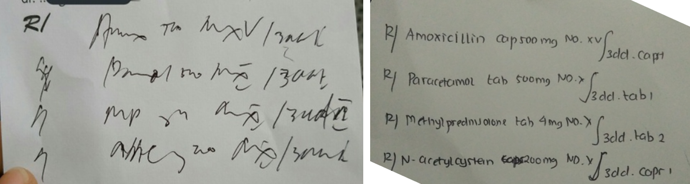

## A little Background..

Teks biasa atau *plain text* merupakan hal yang penting dalam dunia komunikasi, baik di dunia nyata maupun di dunia komputer. Apa yang ingin disampaikan harus tertulis dengan **jelas**. Kenapa? agar bisa dimengerti.

Coba lihat diantara tulisan ini, mana yang lebih mudah dipahami?

```{r, echo=FALSE,warning=FALSE}
library(knitr)

```

Gambar diatas merupakan screenshot [jawaban Quora](https://id.quora.com/Mengapa-tulisan-dokter-jelek-saat-menulis-resep) yang saya ambil. Yang kiri merupakan tulisan aslinya dan yang kanan setelah ditulis ulang. Jauh banget kan perbedaannya.

## Apa itu markdown?

Secara teknis markdown adalah sintaks ringan untuk merubah teks biasa menjadi teks yang berformat.

## Contoh penggunaan markdown

Sintaksnya sederhana. Saya coba tabelkan beberapa penggunaannya seperti ini:

+-------------------------------+-------------------------------------------+-----------------------------------------+
| Penggunaan                    | Sintaks                                   | Hasil                                   |
+:==============================+===========================================+=========================================+
| Heading 1 dan seterusnya      | `# Heading 1`                             | # Heading 1                             |
|                               |                                           |                                         |
|                               | `## Heading 2`                            | ## Heading 2                            |
|                               |                                           |                                         |
|                               | `### Heading 3`                           | ### Heading 3                           |
+-------------------------------+-------------------------------------------+-----------------------------------------+
| Menulis tebal (bold)          | `**tulisan tebal**`                       | **tulisan tebal**                       |
+-------------------------------+-------------------------------------------+-----------------------------------------+
| Menulis miring (italic)       | `*tulisan miring*`                        | *tulisan miring*                        |
+-------------------------------+-------------------------------------------+-----------------------------------------+
| Menulis coret (strikethrough) | `~~tulisan coret~~`                       | ~~tulisan coret~~                       |
+-------------------------------+-------------------------------------------+-----------------------------------------+
| Link ke url                   | `[website ini keren!](irpanchumaedi.com`) | [website ini keren!](irpanchumaedi.com) |
+-------------------------------+-------------------------------------------+-----------------------------------------+

## Referensi

[Markdown - Wikipedia](https://en.wikipedia.org/wiki/Markdown)
